# Design & Implementation Plan: International Brand Storefront Transformation

This document outlines the architectural and UI/UX design overhaul to transform the current storefront from a generic prototype into a world-class, high-impact digital flagship store inspired by **Nike**, **Zara**, and **Gymshark**.

---

## 1. Goal Description

### The Problem
The current storefront interface (as captured in [`fullpage_snapshot_192_168_0_125_2026-10-10-13-59-57.png`](./fullpage_snapshot_192_168_0_125_2026-10-10-13-59-57.png)) suffers from:
1. **Missing Visual Anchor**: The hero banner is empty, dumping visitors straight into category lists.
2. **Wireframe/Placeholder Aesthetics**: Categories display letter boxes (`W`, `M`, `F`, `B`) without editorial photography.
3. **Empty & Unbalanced Catalog**: Only 2 products rendered across a 4-column layout leaving vast blank space.
4. **Generic Template Details**: Bright green rounded badges, basic sans-serif typography, and duplicated trust badge strips (one in body, one in footer).
5. **Brand Identity Fragmentation**: Inconsistent names (`Apex Cart`, `APEX/BATA`, `ligglo Fashion Zone`).

### The Objective
Elevate the entire customer experience into an **editorial, bold, and modern luxury brand standard**:
- Full-bleed cinematic Hero Slider with bold typography and dual pill CTAs.
- High-res portrait lifestyle Category Showcase (4:5 aspect ratio) with smooth zoom micro-interactions.
- Borderless, minimalist Nike-style Product Cards with soft neutral image backdrops, secondary image hover switch, clean typographic hierarchy, and quick-add actions.
- Magazine-style Editorial Story Spotlight & sleek Brand vector strip.
- Cohesive typography (`font-black tracking-tighter uppercase` headers) and cleaned up single-source trust badges.

---

## 2. Design Architecture & Visual Hierarchy

```mermaid
flowchart TD
    subgraph BrandExperience["Global Brand Flagship Experience"]
        Header["1. Translucent Sticky Header (Glassmorphic, Search Pill, Unified Brand)"]
        Hero["2. Cinematic Editorial Hero (16:9 / Full-Bleed, Bold Headlines, Dual CTAs)"]
        Category["3. Curated Lifestyle Categories (4:5 Portrait Cards with Zoom on Hover)"]
        Featured["4. Minimalist Product Showcase ('Trending Drops', Borderless Cards, Hover Flips)"]
        Spotlight["5. Editorial Split Promo ('The Atelier / Season Lookbook')"]
        Arrivals["6. New Season Arrivals (Balanced 4-col / 8-item Grid)"]
        Brands["7. Monochrome Heritage Brand Strip"]
        Trust["8. Refined Single Trust Guarantee Strip"]
        Footer["9. Cohesive Minimalist Dark Flagship Footer"]
    end
    Header --> Hero --> Category --> Featured --> Spotlight --> Arrivals --> Brands --> Trust --> Footer
```



---

## 3. Key Design Decisions

> [!IMPORTANT]
> **Brand Name Unification**:
> Standardize the brand identity to **"LIGGLO" / "Ligglo Atelier"** across the Announcement Bar, Header, Newsletter, and Footer to eliminate conflicting names like *Apex Cart* vs *ligglo Fashion Zone*.
>
> **Mock & Visual Assets**:
> Inject high-res, optimized fashion and footwear imagery from Unsplash (curated streetwear, minimalist leather goods, sneakers) so the storefront looks populated and production-grade out of the box.

---

## 4. Proposed Changes by Component

### Component 1: Visual Data Foundation (`frontend/lib/api/mock/data.js`)
- Populate `mockBanners.hero` with 3 cinematic slides featuring high-resolution fashion photography, punchy headlines, subheadings, and action buttons.
- Populate `mockBanners.promo` with an editorial split-banner campaign (*"ENGINEERED FOR MODERN LUXURY"*).
- Add high-quality portrait imagery to all categories (`Women's`, `Men's`, `Footwear`, `Bags & Accessories`, `Accessories`).
- Expand `mockProducts` from 2 items to 8+ diverse items with dual images (`image` and `hover_image`) to enable dynamic hover card flipping.
- Unify brand identity settings across the store.

---

### Component 2: Cinematic Hero Banner (`frontend/components/home/HeroBanner.jsx`)
- Switch from standard container box to edge-to-edge / cinema viewport height (`min-h-[580px] lg:min-h-[700px]`).
- Bold Nike-style typographic treatment:
  - Extra-bold condensed display title: `text-4xl sm:text-6xl lg:text-7xl font-black uppercase tracking-tighter`.
  - Subtle gold or monochrome kicker badge: `tracking-[0.25em] text-xs font-bold uppercase`.
- Dual action pill buttons:
  - Primary button: `rounded-full px-8 py-3.5 bg-white text-black font-bold uppercase tracking-wider hover:bg-neutral-200 transition-all shadow-xl hover:scale-105 active:scale-95`.
  - Secondary ghost button: `rounded-full px-8 py-3.5 bg-white/10 backdrop-blur-md text-white border border-white/30 font-bold uppercase tracking-wider hover:bg-white/20 transition-all`.
- Modern progress pill indicators & sleek floating arrow navigation.

---

### Component 3: Editorial Category Grid (`frontend/components/home/CategoryGrid.jsx`)
- Replace square card letter-boxes with **4:5 vertical portrait lifestyle tiles**.
- Gradient vignette scrim (`bg-gradient-to-t from-black/80 via-black/20 to-transparent`).
- Typography positioned at bottom with bold uppercase title and curated item count:
  - `font-black text-lg sm:text-xl text-white uppercase tracking-tight`.
- Micro-interactions: `group-hover:scale-108 transition-transform duration-700 ease-out` and subtle hover border glow.

---

### Component 4: Minimalist & Borderless Product Card (`frontend/components/product/ProductCard.jsx`)
- **Container**: Borderless, sleek structure with soft neutral image backdrop (`bg-[#f6f6f6]` / `bg-neutral-100`).
- **Image Switcher**: Show primary product photo; smoothly fade in the second angle/on-model photo on hover (`group-hover:opacity-100`).
- **Refined Badging**: Remove the bulky bright green pill; replace with minimalist monochrome text badges:
  - *"Just In"* or *"Best Seller"* (`text-[10px] font-black uppercase tracking-widest text-neutral-900 bg-white/90 backdrop-blur-xs px-2.5 py-1 rounded-sm shadow-xs`).
- **Typography & Details**:
  - Category / Brand: `text-[11px] font-bold uppercase tracking-widest text-neutral-400`.
  - Product Title: `font-bold text-sm sm:text-base text-neutral-900 leading-snug hover:text-black line-clamp-1`.
  - Colorway count tag: *"3 Colours"*.
  - Price: Bold, modern tabular numerals.
- **Quick-Add & Wishlist**: Floating glassmorphism Wishlist heart icon (top right) and subtle Quick-Add pill button on hover.

---

### Component 5: Product Section & Section Headers (`frontend/components/home/FeaturedSection.jsx`)
- Update header to Nike editorial style:
  - Category tagline: `text-xs font-black uppercase tracking-[0.2em] text-neutral-400`.
  - Headline: `text-2xl sm:text-4xl font-black uppercase tracking-tighter text-neutral-900`.
  - Sleek horizontal slider arrows or "Shop All" link with an arrow icon.
- Ensure 4-column responsive grid on desktop with 8 balanced items.

---

### Component 6: Editorial Story Spotlight (`frontend/components/home/PromoBanner.jsx`)
- Transform the promo banner into a **Nike-style "Spotlight" Story Section**.
- Split or full-width campaign block featuring high-fashion photography, bold editorial copy (*"CRAFTED FOR EVERY MOVE"*), and dedicated collection links.

---

### Component 7: Trust Badges & Header / Footer Deduplication
- **`TrustBadges.jsx`**: Refine into a sleek, minimalist horizontal ribbon with subtle monochrome or gold accents.
- **`Footer.jsx`**: Remove the duplicated "Top Features Strip" in `Footer.jsx` that was repeating the trust badges right below the newsletter; harmonize store branding.
- **`Header.jsx`**: Enhance glassmorphic sticky blur (`backdrop-blur-md bg-white/90`), refine typography and navigation menu hover lines.

---

## 5. Verification Plan

### Automated Checks
1. Check syntax and build compatibility:
   ```bash
   cd frontend
   npm run build
   ```
2. Validate mock data loading and image URL resolution.

### Manual Visual Verification
1. Verify the Hero Slider auto-plays, has high-contrast legible text, and buttons are responsive.
2. Verify all Category Cards show high-quality fashion models/products without any single-letter grey boxes.
3. Verify Product Cards have balanced 4-column layout, image hover transition, and clean minimalist pricing and tags.
4. Verify no duplicated trust badge strips appear between the newsletter and footer.
5. Take a new fullpage snapshot to contrast directly with [`fullpage_snapshot_192_168_0_125_2026-10-10-13-59-57.png`](./fullpage_snapshot_192_168_0_125_2026-10-10-13-59-57.png).

---

## 6. Execution Steps Summary
1. **Step 1**: Write updated mock data with rich visual assets in `frontend/lib/api/mock/data.js`.
2. **Step 2**: Upgrade `HeroBanner.jsx` with full-bleed editorial slides & bold typography.
3. **Step 3**: Upgrade `CategoryGrid.jsx` to 4:5 portrait lifestyle cards.
4. **Step 4**: Upgrade `ProductCard.jsx` to borderless Nike-style cards with hover flipping.
5. **Step 5**: Upgrade `PromoBanner.jsx` & `FeaturedSection.jsx` styling.
6. **Step 6**: Clean up and deduplicate `TrustBadges.jsx` and `Footer.jsx`.
7. **Step 7**: Verify build and inspect output.
